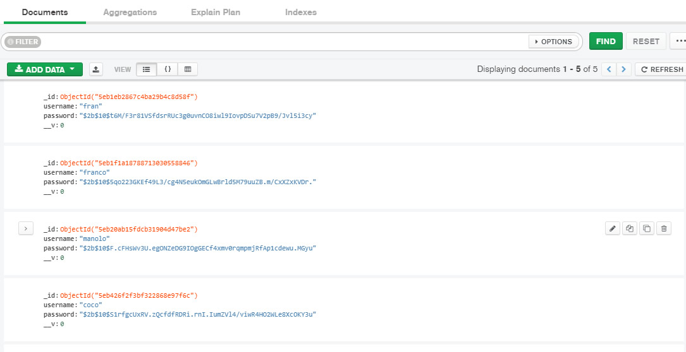

<h1 style="color:green">Registro y autenticacion de usuarios</h1>

Proyecto inicio de sesión que valida los datos de registro con usuario y contraseña y muestra si son correctos o no. Si los datos coinciden son cargados en la base de datos.

DEPLOY EN HEROKU:

Imagen Demo de Base de datos MongoDB funcionando con el envio de datos de  los registros de usuario.
</img>

**Para el desarrollo utilice:**
<ul>
<li>HTML</li>
<li>CSS</li>
<li>Node</li>
<li>Express</li>
<li>Bcrypt</li>
<li>Mongoosee - DB= mongoDB</li> 
</ul>

***Tareas a Realizar***
